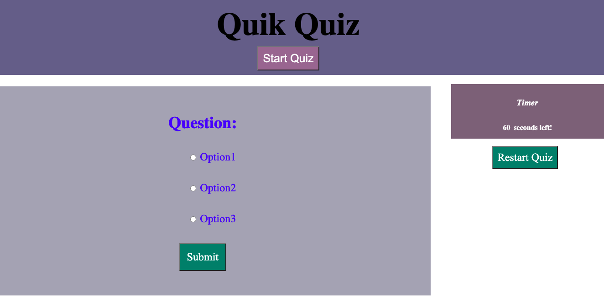

# Quick Quiz
 
## Description

Create a quick quiz application with timer using HTML, CSS and JavaScript.

## How to use the application
### when you click the start button, a timer starts and a question is presented.
### when a question is answered and clicked the submit button, another question is presented.
### WHEN all questions are answered or the timer goes off, the quiz is over.
### when the quiz is over, you can save your initials and score.

## Live Link

https://jean424.github.io/Code_Quiz/

